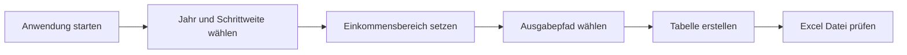

# Anwenderdokumentation – Lohnsteuertabellen-Ersteller

Diese Dokumentation richtet sich an Anwenderinnen und Anwender der Anwendung.

## ⚠️ Wichtiger Hinweis zur Verbindlichkeit

Die erzeugten Lohnsteuertabellen enthalten **Näherungswerte** und sind **nicht offiziell/amtlich**.
Für rechtsverbindliche Berechnungen sind immer die offiziellen Veröffentlichungen und Rechenwege maßgeblich.

## Ablauf auf einen Blick




## Schnellstart

1. Anwendung starten (`tax_table_gui.py` oder EXE).
2. Jahr auswählen.
3. Schrittweite (3, 5, 10 oder 50) festlegen.
4. Einkommensbereich eingeben.
5. Ausgabepfad wählen.
6. „Tabelle erstellen“ klicken.

### Vollautomatisch / Headless (ohne GUI)

Die EXE kann auch ohne GUI direkt per Kommandozeile ausgeführt werden:

```text
Lohnsteuertabellen-Ersteller.exe --headless --year 2026 --output .\Lohnsteuer_2026_West_monatlich.xlsx --income-min 1000 --income-max 10000 --step 5
```

Unterstützte Headless-Parameter:

- `--headless`: Erzwingt CLI-Ausführung ohne GUI
- `--year`: Steuerjahr (z. B. `2026`)
- `-o`, `--output`: Ausgabedatei oder Zielordner
- `--income-min`: Minimales Einkommen in EUR
- `--income-max`: Maximales Einkommen in EUR
- `--step`: Schrittweite in EUR (`3`, `5`, `10`, `50`)
- `--quiet`: Minimale Konsolenausgabe

## Eingabefelder

| Feld | Bedeutung |
| --- | --- |
| Jahr | Unterstütztes Steuerjahr |
| Schrittweite | Abstufung in EUR |
| Einkommen min/max | Untere/obere Grenze für die Tabellenwerte |
| Ausgabedatei | Zielordner oder Dateiname (`.xlsx`) |

## Ergebnis

Die Anwendung erzeugt eine Excel-Datei mit:

- einem kompakten Übersichtsblatt
- einem Rohdatenblatt mit den berechneten Details

## Hinweise

- Die Berechnung orientiert sich an BMF/PAP-Daten.
- Die Ergebnisse sind Näherungswerte und nicht als amtliche Tabellen zu verstehen.
- Für amtliche Einzelfälle immer die offiziellen Quellen prüfen.
- Bei ungültigen Eingaben zeigt die Anwendung eine klare Fehlermeldung.

## Support

- Technische Details: `docs/DOKUMENTATION_TECHNIK.md`
- Berechnungsdetails: `docs/DOKUMENTATION_KALKULATION.md`

---

**Version:** 1.2.4  
**Stand:** 30.05.2026  
**Autor:** GoroTech
